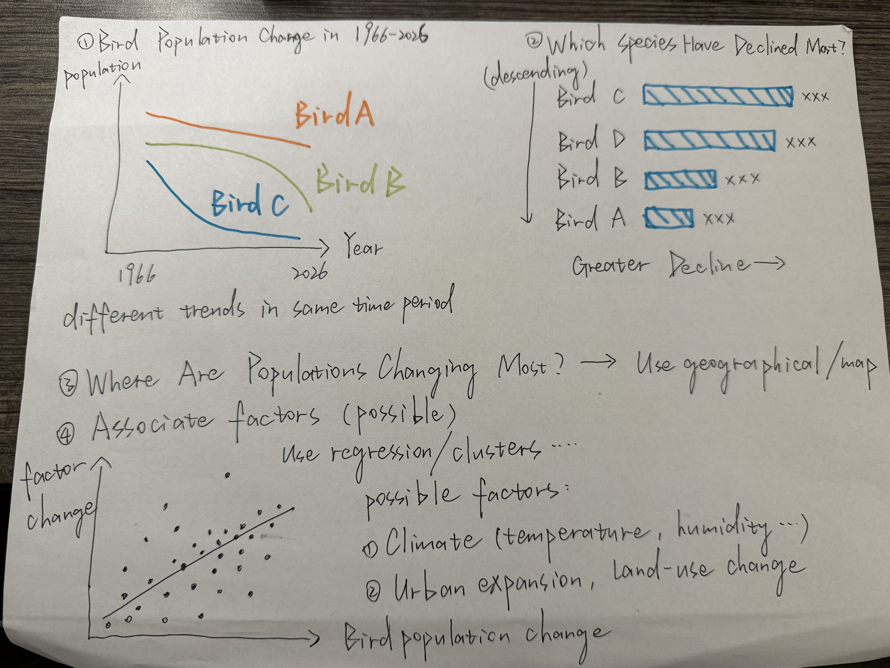

| [home page](https://cmustudent.github.io/tswd-portfolio-templates/) | [data viz examples](dataviz-examples) | [critique by design](critique-by-design) | [final project I](final-project-part-one) | [final project II](final-project-part-two) | [final project III](final-project-part-three) |

> Important note: this template includes major elements of Part I, but the instructions on Canvas are the authoritative source.  Make sure to read through the assignment page and review the rubric to confirm you have everything you need before submitting.  When done, delete these instructions before submitting.

# Outline
> Include a high-level summary of your project.  This should be a couple paragraphs that describe what you're interested in showing with your final project. 

**Summary**

Topic (tentative): Endangered and Threatened Birds in North America: Understanding Long-Term Population Decline

For my final project, I plan to explore long-term population changes among threatened and endangered bird species in North America. Bird populations can change substantially over time, and these changes are different across species or geographic areas. Through data visualization, I hope to show which species have experienced notable population declines, how their populations have changed over time, and where these patterns are occurring.

The project will primarily use long-term bird population data from the U.S. Geological Survey’s North American Breeding Bird Survey (BBS), together with conservation status information from the U.S. Fish and Wildlife Service. I may also incorporate environmental data, such as land-use change, urban development, or climate conditions, to explore possible factors associated with observed population patterns. 

> A project structure that outlines the major elements of your story.  Your Good Charts text talks about story structure in Chapter 8 - you should describe what you hope to achieve.  Make sure the outline is detailed enough that we can see how you anticipate your story unfolding.  You can incorporate your Story Arc from the in-class exercise along with your user stories and one sentence summary to make the topic even more clear. 

**Project Structure**

1. **Introduction – Why Are These Birds at Risk?**
   Introduce threatened and endangered bird species in North America, and explain why monitoring long-term population changes is important.

2. **The Long-Term Trends – How Have Populations Changed?**
   Show how populations of selected threatened and endangered bird species have changed over time using long-term Breeding Bird Survey data. Present the main population trends and allow the audience to see that different species may follow very different trajectories.

3. **Identifying the Most Significant Declines**
   Compare population trends across selected species to highlight which birds have experienced particularly substantial declines. 

4. **Exploring Where and Why Patterns Differ**
   Examine geographic differences in population trends and, where appropriate, incorporate supplementary environmental data such as land-use change, urban development, or climate conditions. Explore possible associations rather than claim direct causation.

5. **Conclusion – What Can We Learn from These Patterns?**
   Bring the population, geographic, and environmental patterns together to summarize what the data reveals about the challenges facing threatened and endangered birds. Emphasize the importance of long-term monitoring and protection.

## Initial sketches
> Post images of your anticipated data visualizations (sketches are fine). They should mimic aspects of your outline, and include elements of your story.  

# The data
> A couple of paragraphs that document your data source(s), and an explanation of how you plan on using your data. 

**USGS North American Breeding Bird Survey (BBS)**
The primary dataset for this project. The Core Indices and Core Trends datasets will be used to examine annual population patterns and long-term trends among selected bird species from 1966–2025.

**U.S. Fish & Wildlife Service (FWS) ECOS**
FWS ECOS data will be used to identify bird species that are federally listed as threatened or endangered. This information will be used to connect official conservation status with the population trends found in the BBS data.

**USGS Annual National Land Cover Database (Annual NLCD) - Alternative**
USGS Annual NLCD might be used to explore changes in land use and urban development. This data could help provide environmental context for geographic differences in bird population trends. 

**NOAA Climate Data Online (CDO) - Alternative**
NOAA climate data might be used to explore whether temperature or precipitation patterns are associated with changes in bird populations. This data would serve as additional environmental context.

> A link to the publicly-accessible datasets you plan on using, or a link to a copy of the data you've uploaded to your Github repository, Box account or other publicly-accessible location. Using a datasource that is already publicly accessible is highly encouraged.  If you anticipate using a data source other than something that would be publicly available please talk to me first. 

| Name | URL | Description |
|------|-----|-------------|
|USGS North American Breeding Bird Survey (BBS)|https://www.usgs.gov/data/north-american-breeding-bird-survey-analysis-results-1966-2025|Primary dataset for population patterns and long-time trends|
|U.S. Fish & Wildlife Service (FWS) ECOS|https://ecos.fws.gov/ecp/species-reports|Primary dataset for official conservation |
|USGS Annual National Land Cover Database (Annual NLCD)|https://www.usgs.gov/centers/eros/science/annual-national-land-cover-database|Alternative dataset for geographical context|
|NOAA Climate Data Online (CDO)|https://www.ncei.noaa.gov/cdo-web/|Alternative dataset for environmental context|

# Method and medium
> In a few sentences, you should document how you plan on completing your final project. 

Text here...

## References
_List any references you used here._

## AI acknowledgements
_If you used AI to help you complete this assignment (within the parameters of the instruction and course guidelines), detail your use of AI for this assignment here._
